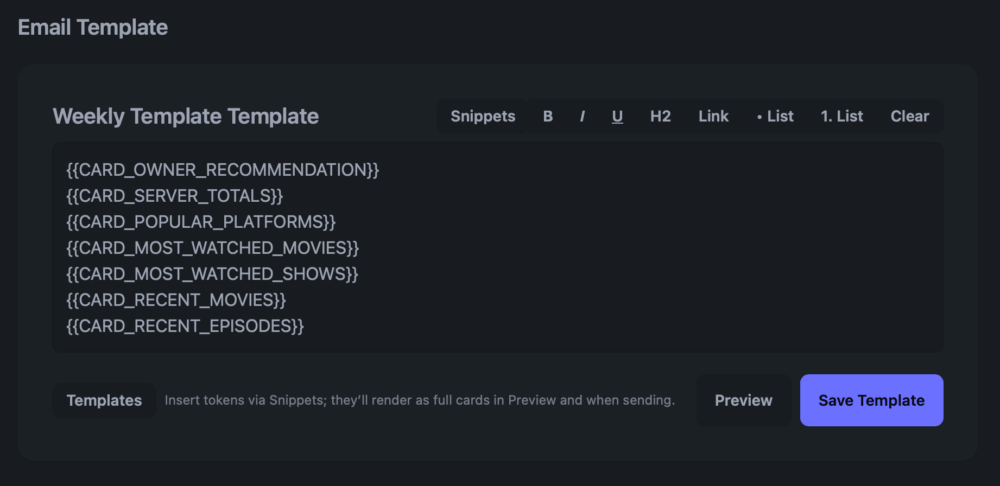
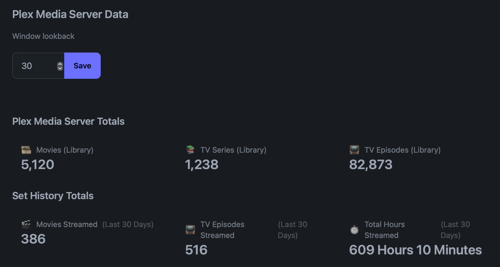
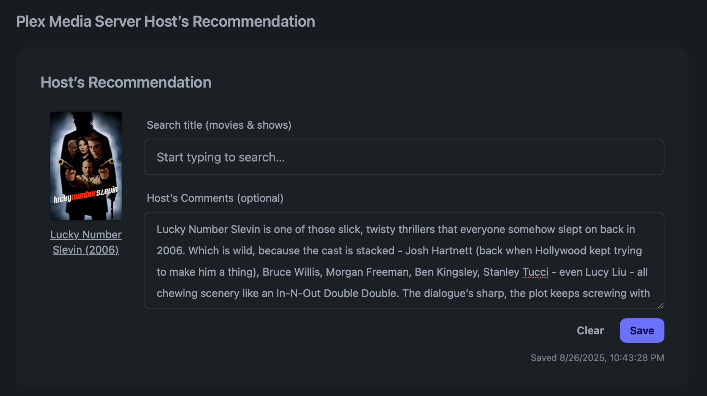
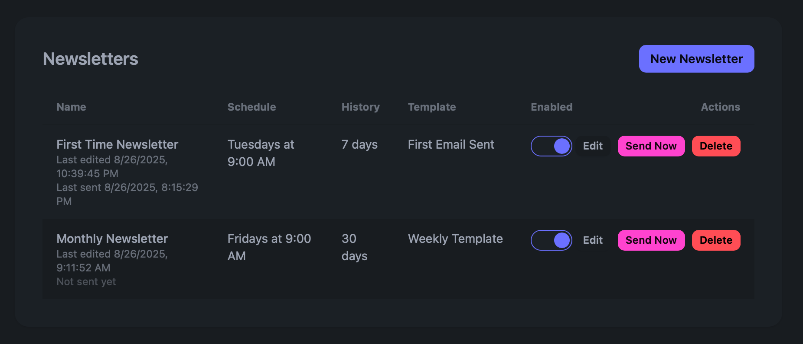

# Newzlettr  
**Extend Tautulli with flexible and personalized newsletters.**  

A supplemental tool that runs *with* Tautulli, giving Plex Media Server hosts more flexibility to keep their guests informed with customized, data-driven emails.  

---

## Features  

- **Automatic Plex + Tautulli Integration**  
  - Pulls stats from your Plex Media Server and Tautulli.  
  - Includes library totals, recently added items, and playback history.  

- **Beautiful Email Newsletters**  
  - Generate styled newsletters for your Plex guests.  
  - Preview emails in the web UI before sending.  

- **Cloudinary Image Hosting**  
  - Fully integrated — cover art and media images are hosted and delivered reliably.  

- **Manual Host Recommendation**  
  - Add your own personal “Host’s Recommendation” (by design).  

- **Simple Setup**  
  - Config files are created automatically on first run.  
  - Just provide your Plex/Tautulli tokens and SMTP credentials.  

- **Cross-Platform Support**  
  - Works on macOS, Linux, and Windows with Node.js.  

---

## Screenshots & Highlights  

Newzlettr is designed to work *alongside* Tautulli — not replace it.  
It uses the data Tautulli collects, but gives you more flexibility in how you present that information to your Plex Media Server guests.  

### 1. Fully Editable HTML Newsletter  
You’re not locked into a fixed layout — build your own newsletter template using snippets and dynamic tokens.  

  

---

### 2. Rich Server Data in Your Emails  
Bring in detailed Plex + Tautulli stats:  
- Library totals (movies, shows, episodes)  
- Most watched content  
- Recently added titles  
- Playback activity (hours, episodes, movies streamed)  

  

---

### 3. Personalized Host’s Recommendation  
Go beyond just numbers — add your own movie/show recommendation with a description.  
This makes each newsletter more personal and engaging.  

  

---

### 4. Easy Scheduling & Management  
Create multiple newsletters (weekly, monthly, etc.), toggle them on/off, edit templates, or send one immediately.  

  

---

👉 By working with Tautulli, Newzlettr helps you keep Plex guests updated with a mix of **data, insights, and your own voice** — all in a polished, customizable format.  

---

## Getting Started  

### Platforms  
- **Operating Systems:** macOS, Linux, Windows (anywhere Node.js can run).  
- **Browsers:** Works with all modern browsers (Chrome, Edge, Firefox, Safari).  
- **Hosting:** Currently runs **only on the same machine where it’s installed**.  
  - Accessible at:  
    ```
    http://localhost:5173
    ```
  - Remote or network hosting is not yet supported.  

---

### Pre-Requisites  
Make sure you have the following before installing:  

- **Node.js & npm**  
  - Node.js v18+ recommended.  
- **Plex Media Server**  
  - No modifications needed.  
  - Must be accessible via **HTTP only**.  
- **Tautulli**  
  - Must be accessible via **HTTP only**.  
  - HTTPS/self-signed certificates are **not supported** (disable HTTPS in Tautulli settings).  
- **API Credentials**  
  - Plex API token.  
  - Tautulli API key.  
- **Configuration**  
  - Config files are created automatically on first run.  
- **Email (SMTP)**  
  - SMTP credentials are required to send newsletters (Gmail, Outlook, etc.).  
- **Cloudinary (Optional)**  
  - Fully supported for hosting and serving images.  

---

### Installation  

Clone the repository and install dependencies:  

```bash
git clone https://github.com/jeff-blep/newzlettr.git
cd newzlettr
npm install
```
To fire it up:
```bash
npm run newzlettr
```
Then, head over to ```http://localhost:5173```, click the Settings cog on the top left, enter your info, you're off to the races!


